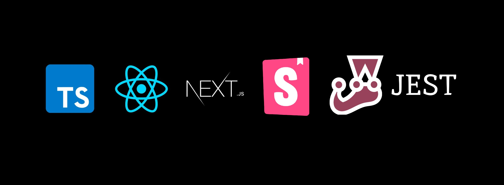

# Netzsch test from Offer - Instructions:

### 1) Clone Project `git clone https://github.com/thiagolucio/Netzsch_test.git `

### 2) Install Packages: `npm install`
 
### 3) Run Project: 
- Run `npm run api` to run local API Mock from Project
- Run `npm run dev`to run local Client Front-end Project.

## 4) Validate/ Tests:
- Run `npm run storybook`to run local Storybook and open browser intarface to taste components.
- Run `npm run test`to run Jest tests from project.

### 5) Documentation (reusable components):

- I create simple documentation regarding reusable components that can be seen here through the [Wikki](WIKKI.md) file within the project root.

### Techs:

- ReactJS through Next with TypeScript.
- TailwindCSS
- Storybook for functionality testing and technical showcase
- Jest for testing.
- Lottie for animations.
- 
### Comments about:

- I tried to work with the latest version of NextJS as indicated in the official React documentation [ReactJS Start New Project](https://react.dev/learn/start-a-new-react-project) 
- I haven't worked with WebAssembly previously but I also tried to do the same thing suggested in the test text, create a component to receive values in Celsius and convert to Fareinheight. You will find it in the components with the folder named "temperature".
- This project was not created to run in production and was made for technical evaluation only (a POC).
- Both Storybook and Jest do not cover the entire project, just a few examples were created to demonstrate knowledge in implementing and configuring.
- The graph from **"Rechart"** presented is simple, just to demonstrate knowledge, and is not a reusable component, which in some cases would be normal to be done in a real project.

### Concerns:

- I did the best I could with the time I had for it. It took 3 days to do it in the middle of one of the most celebrated holidays in Brazil (Carnival) and with family at home visiting me. I don't know if this matters for your assessment, but it certainly had a huge impact on my time available to carry out this test.
