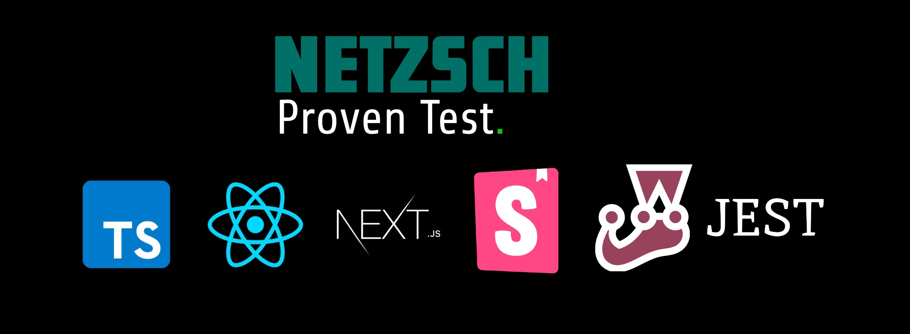

<center>



[](https://opensource.org/licenses/)

</center>

# Netzsch test from Offer - Instructions:

1) Clone Project:
- Clone this repo with ```bash git clone https://github.com/thiagolucio/Netzsch_test.git ```

2) Install Packages:
- Run `npm install --legacy-peer-deps` to install node_modules with 100% compatible between packages and their own dependencies.   

3) Run Project: 
- Run `npm run api` to run local API Mock from Project
- Run `npm run dev`to run local Client Front-end Project.

4) For Validate:

- Run `npm run storybook`to run local Storybook and open browser intarface to taste components.
- Run `npm run test`to run Jest tests from project.


### Documentation (reusable components):
- I created a simple documentation model for implementing reusable components and they can be seen in the project root.

<br>

[Wikki](WIKKI.md)


### Comments about:
- Procurei trabalhar com a última versão do NextJS como indicado na documentação oficial do React:
  <br />
  [ReactJS Start New Project](https://react.dev/learn/start-a-new-react-project).
- I decided to create my own backend (API) based on the solution pointed out in the document sent and thus not depend on any external solution or connection.
- This project was not created to run in production and was made for technical evaluation only (a POC).
- Both Storybook and Jest do not cover the entire project, just a few examples were created to demonstrate knowledge in implementing and configuring.
- The graph from **"Rechart"** presented is simple, just to demonstrate knowledge, and is not a reusable component, which in some cases would be normal to be done in a real project.


### Tecnologias utilizadas:
- ReactJS through Next with TypeScript.
- TailwindCSS
- Storybook for functionality testing and technical showcase
- Jest for testing.
- Lottie for animations.


### Concerns:
- I did the best I could with the time I had for it. It took 3 days to do it in the middle of one of the most celebrated holidays in Brazil (Carnival) and with family at home visiting me. I don't know if this matters for your assessment, but it certainly had a huge impact on my time available to carry out this test.